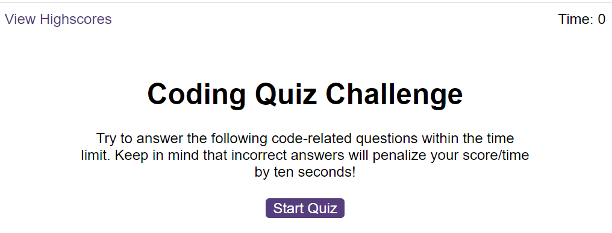
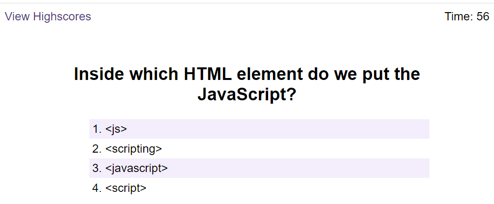
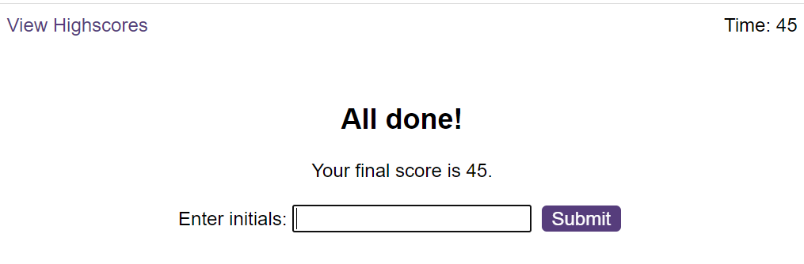
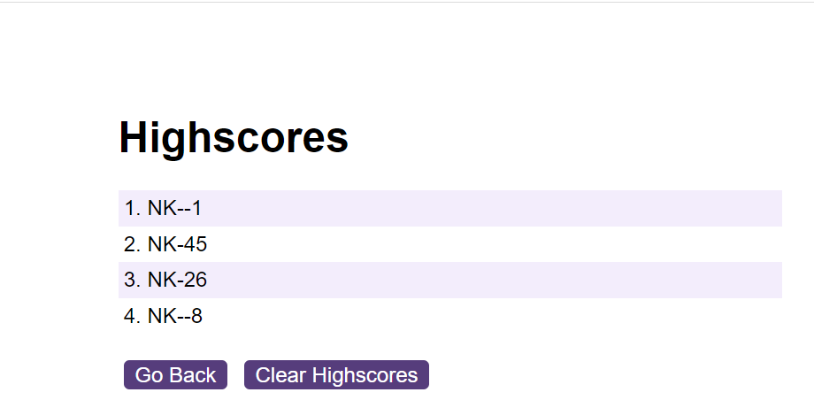

# JavaScript Quiz

## Description
This is quiz application asks 6 JavaScript questions in 60 seconds.
Each wrong answer will deduct 10 seconds from quiz duration.
At the end remaining seconds will be considered as score.

User with more accuracy and use less time will get highest score.

Web site will play a different sounds for correct and incorrect answers.

## Main Page
Main page looks as below.
Click on the "Start Quiz" button.

## Question Page
Question page looks as below.
Each question have options with one correct answer. 
Select the right answer.

Remaining time will appear at top-right corner of the page.

## End of Quiz Page
End of the quiz below page appears.
Here user eneter the initials and click on Submit button.
This action will save the scores on local storage.

## Highscores Page
After you submit your initials, it'll show scores page.
Here use can see all their high scores as shown below

### The URL of the deployed application

https://nandanippani.github.io/JSQuiz

### The URL of the GitHub repository that contains my code

https://github.com/Nandanippani/JSQuiz

## Installation

N/A

## Usage

This project is used to demonstrate ability to use functions, return variables, while loop and global variables.

## Credits

N/A

## License

Please refer to the LICENSE in the repo.
